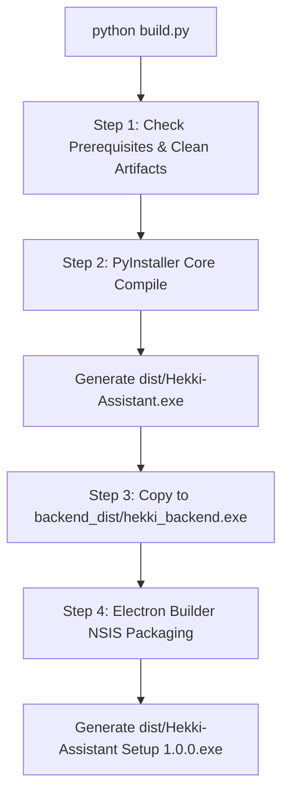

# HEKKI Assistant — Building & Packaging Guide

This document outlines the official, one-command build pipeline for **Hekki Assistant** Desktop Application (Windows).

---

## 🚀 Quick Start (One-Click Build)

To build the complete desktop application and NSIS Setup Installer from scratch:

```bash
python build.py
```

---

## 🏗️ Architecture & Build Pipeline

The master script [`build.py`](file:///d:/Hekki-Assistant/build.py) executes a 5-step automated workflow:



### Build Steps Breakdown:

1. **Step 1 — Clean:** Removes previous `build/`, `dist/`, and `backend_dist/` directories.
2. **Step 2 — Core Engine PyInstaller Compilation:** Compiles `run_web.py` + FastAPI backend + dynamic routes + skills + prompts + static web UI into a single portable binary (`dist/Hekki-Assistant.exe`).
3. **Step 3 — Resource Linking:** Copies `dist/Hekki-Assistant.exe` into `backend_dist/hekki_backend.exe` for Electron resource bundling.
4. **Step 4 — Electron NSIS Desktop Packaging:** Invokes `npx electron-builder` using `package.json` configuration to bundle the native Electron shell (`electron_main.js`, frameless window, system tray, hotkeys) into an official NSIS Windows Installer (`dist/Hekki-Assistant Setup 1.0.0.exe`).
5. **Step 5 — Verification & Summary Report:** Validates artifact integrity and outputs file sizes.

---

## 📁 Output Artifacts Location

All final binaries are placed inside the `dist/` directory:

- 📦 **Setup Installer:** `dist/Hekki-Assistant Setup 1.0.0.exe` *(Full Windows NSIS Installer)*
- 💻 **Portable Binary:** `dist/Hekki-Assistant.exe` *(Standalone Portable App)*
- 📂 **Unpacked Electron Package:** `dist/win-unpacked/`

---

## 🤖 Instructions for AI Coding Agents

Whenever a user asks to:
- `"build app"`
- `"build exe"`
- `"compile setup installer"`
- `"build desktop binary"`

Simply execute:
```bash
python build.py
```
Do NOT call individual build scripts manually. `build.py` handles all prerequisites, resource paths, PyInstaller flags, and Electron-builder targets automatically.
