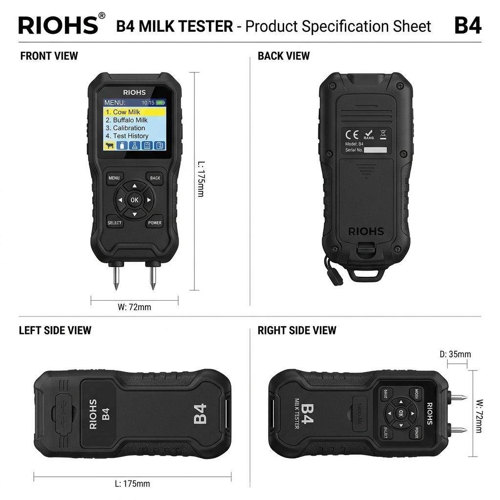
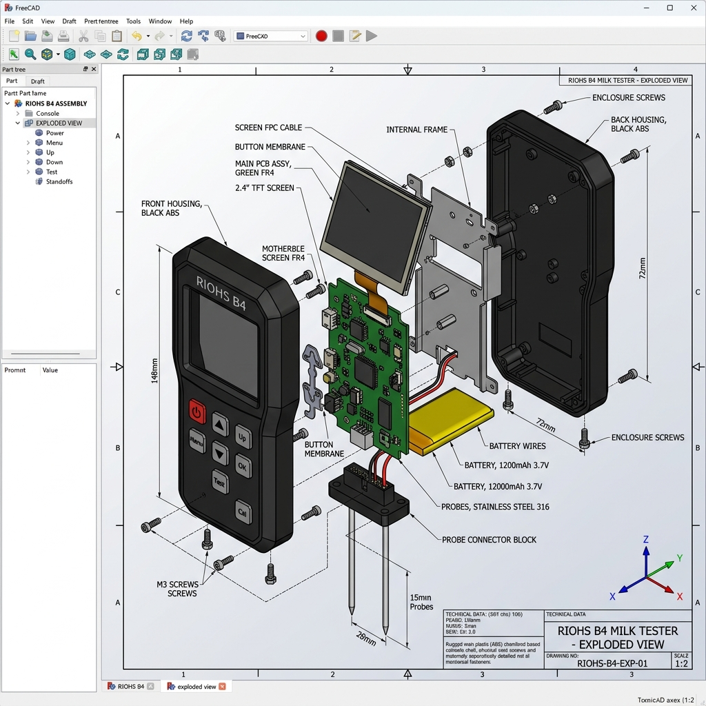
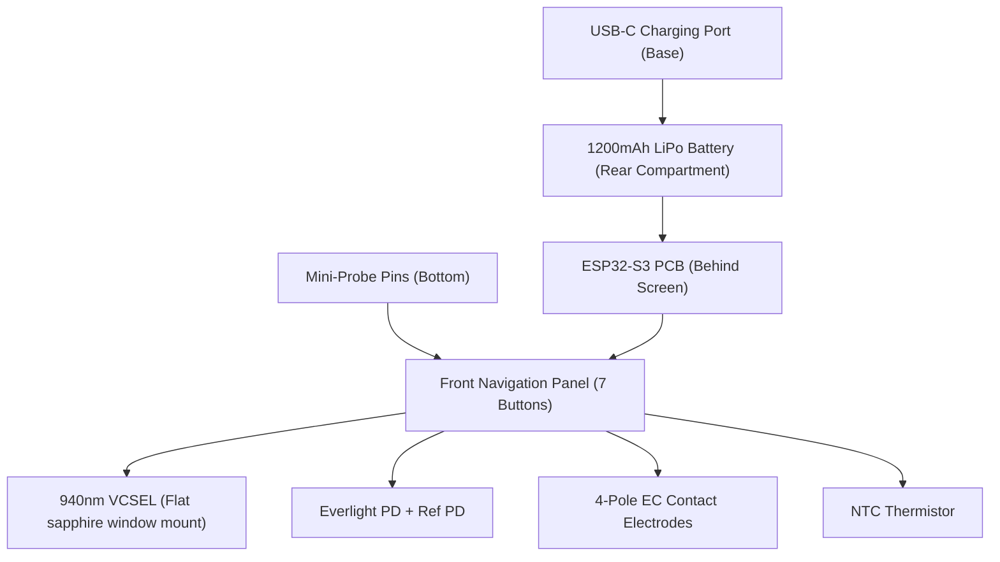

# 📐 RIOHS Base Milk Analyzer: CAD & Component Design Specification

This specification details the industrial design, physical envelope, component layout, and sensing tip geometry for the **RIOHS Base Version** (Family Variant) milk quality analyzer, featuring both the Dip-In immersion wand and the approved Multimeter-style B4 variant.

> [!TIP]
> **💻 Interactive Virtual Prototype (Simulator)**
> You can run and test the complete RIOHS B4 Milk Analyzer (including its D-Pad menus, sensor math, temperature compensation, and real-time digital notch filtering) on your PC! Open the virtual dashboard here: **[virtual_prototype.html](file:///d:/mariano/milk-research/milk-rs-family/virtual_prototype.html)** in your web browser.

---

## 🎨 1. Approved Design: RIOHS Multimeter B4 Variant

The approved design for the rugged utility-focused household tester is the **RIOHS B4 Multimeter Variant**. It features a robust black plastic casing, a vertical color screen, a 7-button navigation panel, and two compact integrated mini-probe pins extending from the base.

The product sheet below displays the **Front View (featuring the Menu Screen)**, **Back View (with battery door & screws)**, **Right Side View**, and **Left Side View** in a single integrated layout for design freeze clearance:



### Key User Interface Elements:
*   **Color Display (Menu Screen):** $2.4\text{-inch}$ vertical LCD showing the core system options:
    1.  `1. Cow Milk Mode`
    2.  `2. Buffalo Milk Mode`
    3.  `3. Sensor Calibration`
    4.  `4. Test History Logs`
    5.  `5. Settings`
*   **7-Button Navigation Panel:**
    *   **Circular D-Pad:** 4 direction keys (Up, Down, Left, Right) to navigate history and configurations.
    *   **Center OK Button:** Selects menu options or starts calibration/testing.
    *   **BACK Button:** Cancels or moves back a screen.
    *   **MENU Button:** Opens settings (e.g. toggle Cow/Buffalo mode, check test log history).
*   **Mini-Probes:** Two small, integrated metal probes at the bottom base, designed for direct immersion in small glasses.

---

## 📱 2. User Interface (UI) Screen Flow

Below is the complete UI design layout mapping out the **six core screen pages** displayed on the $2.4\text{-inch}$ color screen during typical home operations:


---

## 🛠️ 3. 3D CAD Exploded Assembly & Mechanical View

Below is a **3D CAD Exploded Assembly View** of the RIOHS B4 Milk Tester, rendering the internal stacking, split-casing joints, and circuit integration:



Below is the **3D CAD Assembled View** of the fully closed and assembled RIOHS B4 Milk Tester console, showing the chamfered case panels, control buttons, LCD interface screen, and bottom probes:


### Mechanical Assembly Stacking:
1.  **Front Housing Shell:** Molded black ABS carrying the screen protection lens, 7 tactile button keycaps, and bottom pin seals.
2.  **Display & Control Stack:** The $2.4\text{-inch}$ TFT module soldered on the top section of the green PCB.
3.  **Electronics Core:** Green FR4 PCB carrying the ESP32-S3 microcontroller, AD5933 converter, and passive SMD components.
4.  **Energy Storage:** The rechargeable $1200\text{mAh}$ battery pack seated in the lower rear cavity of the shell.
5.  **Rear Housing Shell:** Back cover with integrated battery hatch door and standard M2 seaming screws.

### 🖥️ Native FreeCAD Industrial Modeling Macros
We have developed two FreeCAD macros in the workspace to automatically construct 3D geometries directly in FreeCAD:

1. **Detailed Industrial Assembly Macro**: **[riohs_b4_detailed_mechanical.FCMacro](file:///d:/mariano/milk-research/milk-rs-family/riohs_b4_detailed_mechanical.FCMacro)**
   * *Description:* Creates a complete, high-fidelity mechanical stack following the 20-stage industrial hardware design workflow:
     * **Splitted Shells:** `Front_Housing_Shell` (recessed screen frame pocket, keycap cutouts) and `Rear_Housing_Shell` (with M2 screw bosses, battery bracket, and 4 PCB standoffs) each hollowed to a standard **2.5mm wall thickness**.
     * **Keypad Assembly:** Individual silicone keycaps (`DPad_Silicone_Pad`, `OK_Keycap`, `Menu_Keycap`, `Back_Keycap`).
     * **Internal Components:** Solid representations of the green FR4 PCB board (`ESP32_S3_PCB_Core`), the silver LiPo battery pack (`LiPo_Battery_Pack`), and display assemblies (`TFT_Bezel_Frame`, `LCD_Glass_Panel` with 45% visual transparency).
     * **Sensing Probes:** ABS connector housing and dual stainless steel pins (`Left_EC_Electrode_Pin` and `Right_Optical_Electrode_Pin` with a 5-degree tilted sapphire window slot).
     * **Grips & Overmolds:** Ribbed, textured orange bumpers (`Left_Rubber_Grip` and `Right_Rubber_Grip` with 12 anti-slip ridges).
     * **Fillets & Chamfers:** Multi-radius ergonomic fillets applied to casing corners.

2. **Casing Mockup Macro (Simple)**: **[riohs_b4_multimeter_model.FCMacro](file:///d:/mariano/milk-research/milk-rs-family/riohs_b4_multimeter_model.FCMacro)**
   * *Description:* Generates the outer console mockup in FreeCAD showing the basic solid casing and button alignments.

#### How to Execute in FreeCAD:
1. In FreeCAD, select **Macro** -> **Macros...**.
2. Set the directory path or click **Choose...** to navigate to `d:/mariano/milk-research/milk-rs-family/`.
3. Select `riohs_b4_detailed_mechanical.FCMacro` and click **Execute**.
4. The parts will be generated and color-coded in the document tree. You can toggle parts visibility (spacebar) to inspect internal PCB mounting standoffs, battery holders, and button structures.

---

## 🎨 4. Alternative Design: RIOHS Dip-In Wand

The alternative Dip-In variant is designed as a compact, pen-like handheld immersion probe. It eliminates bulky cup slots, allowing the user to dip the probe shaft directly into any milk glass or vessel for testing.


---

## 📏 5. Physical Dimensions & Housing Specification (B4 Variant)

*   **Envelope Dimensions:** $135\text{mm}$ Height $\times 68\text{mm}$ Width $\times 24\text{mm}$ Depth (rugged console).
*   **Housing Materials:** Injection-molded rugged ABS (matte black finish, rubberized side bumpers).
*   **Ingress Protection:** **IP54** rated (splash-proof buttons, sealed seams, and dust-resistant).
*   **Power Base:**
    *   **Battery:** Rechargeable $1200\text{mAh}$ Lithium Polymer (LiPo) battery pack.
    *   **Charging:** Recessed USB-C charging port on the bottom edge.

---

## 🔩 6. Internal Component Layout & Positioning



### Component Placement:
1.  **Bottom Section (Integrated Mini-Probes):**
    *   **Pins Interface:** Two stainless steel mini-probes housing the 940nm optical sapphire window, NTC thermistor, and coaxial EC electrodes.
2.  **Top Section (Control & Display):**
    *   **PCB Board:** Houses the ESP32-S3, AD5933, OPA350 buffer, and charging circuits directly behind the LCD screen and button contacts.
3.  **Power Base:**
    *   **Battery:** A $1200\text{mAh}$ battery fits inside the rear compartment, providing up to 350 test cycles per charge.

---

## 📱 7. Home Usability Workflow

```
[Power On] --> [Screen: "DIP PROBE PINS"] --> [Dip pins directly into milk (8 sec)] 
   |
   +--> [Beep & Display Results: Quality Score, Water %, Detergent, Freshness]
   |
   +--> [Rinse pins under running tap water (3 sec)] --> [Wipe dry & Store]
```

1.  **Preparation:** The user turns on the device. An automatic dry calibration is run in air ($RI=1.00$) to check optical gain offsets.
2.  **Measurement:** The user dips the bottom mini-probes directly into a cup, glass, or container of milk. The device automatically detects immersion (via a capacitive trigger or conductivity rise), takes measurements for 8 seconds, and beeps when finished.
3.  **Result Display:** The color display on the handle shows:
    *   `Milk Score: 91/100`
    *   `Added Water: 6%` (or `None`)
    *   `Detergent: PASS` (or `HIGH RISK`)
    *   `Freshness: GOOD`
4.  **Hygienic Clean:** The user rinses the tip under a tap. The device automatically runs a 2-second PZT scour pulse during rinsing. The user wipes it with a dry cloth and stores the device.
