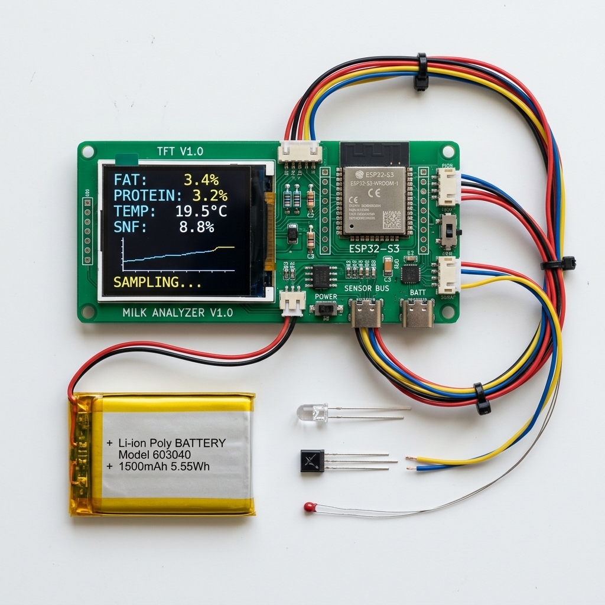
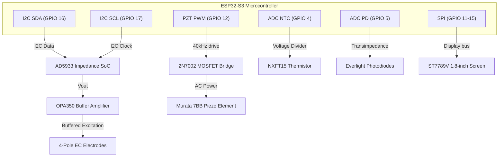

# 🔬 RIOHS Dip-In Milk Analyzer: Detailed Component Specification & BOM

This document provides the complete, itemized Bill of Materials (BOM) and component specifications for the **RIOHS Dip-In** (Family Variant) milk quality analyzer, designed to target a high-volume manufacturing cost of **sub-Rs. 1,150 ($14)**.

---

## 🎨 1. Internal Electronics & Hardware Layout

The image below displays the complete set of electronic components, microcontroller, battery, screen module, and sensors laid out for assembly:

---

## 📋 2. Core Component Breakdown

| Item | Component Name | Manufacturer & Model | Key Specifications | Interface / Control | Est. Unit Cost (10k units, INR) | Est. Unit Cost (USD) |
| :--- | :--- | :--- | :--- | :--- | :--- | :--- |
| **1** | **Microcontroller (MCU)** | Espressif `ESP32-S3-WROOM-1-N8R2` | Dual-core 240MHz, 8MB Flash, 2MB PSRAM, Wi-Fi & Bluetooth LE. | SPI (Display), I2C (AD5933), ADC (NTC), GPIO (PZT/Buttons). | Rs. 175 | $2.10 |
| **2** | **Impedance Converter** | Analog Devices `AD5933YRSZ` | 1 MSPS, 12-Bit Impedance Converter, Network Analyzer (generates 1kHz–100kHz sweep). | I2C Bus | Rs. 290 | $3.50 |
| **3** | **Op-Amp Buffer** | Texas Instruments `OPA350UA` | High-speed, rail-to-rail operational amplifier (38MHz, low distortion). Prevents AD5933 output saturation. | Analog output to outer EC excitation rings. | Rs. 70 | $0.85 |
| **4** | **940nm SW-NIR LED** | Vishay `VSLB9530S` | High radiant intensity, 940nm peak wavelength, 1.3V forward voltage. | Driven via LM334 constant-current sink. | Rs. 12 | $0.15 |
| **5** | **Silicon Photodiode (Ref)**| Everlight `PD204-6C` | Silicon PIN photodiode, high sensitivity to 940nm light. | Transimpedance amplifier input to ESP32 ADC. | Rs. 20 | $0.25 |
| **6** | **Silicon Photodiode (Main)**| Everlight `PD204-6C` | Identical match to reference photodiode to ensure gain symmetry. | Transimpedance amplifier input to ESP32 ADC. | Rs. 20 | $0.25 |
| **7** | **Temperature Sensor** | Murata `NXFT15XH103FA2B0` | NTC Thermistor, 10k $\Omega$ at 25°C, $\pm 1\%$ tolerance, fast response. | Analog voltage divider to ESP32 ADC. | Rs. 10 | $0.12 |
| **8** | **Piezo Transducer** | Murata `7BB-12-9` | 12mm diameter ceramic diaphragm, driven at 40kHz harmonic for active cleaning. | 2N7002 MOSFET bridge on GPIO 12. | Rs. 12 | $0.15 |
| **9** | **TFT Display Screen** | ST7789V 1.8-inch LCD | 1.8-inch color display, 160x128 resolution, backlight LED. | SPI | Rs. 150 | $1.80 |
| **10** | **Rechargeable Battery** | standard 602535 LiPo | 3.7V, 600mAh Lithium Polymer battery pack with protection PCB (PCM). | Direct to TP4056 charger. | Rs. 125 | $1.50 |
| **11** | **Battery Charger IC** | standard `TP4056` | Standalone linear Li-Ion battery charger with thermal regulation. | USB-C input. | Rs. 7 | $0.08 |
| **12** | **Optics Window** | Custom Sapphire Disc | $\varnothing 3\text{mm} \times 1\text{mm}$ flat window, optical-grade polish ($Ra < 0.8\mu\text{m}$). | Compression fit with EPDM O-ring. | Rs. 100 | $1.20 |
| **13** | **Sensing Shaft Sleeve** | Seamless Stainless 316L | Food-grade seamless steel tube ($\varnothing 12\text{mm} \times 70\text{mm}$ length). | Grounded. | Rs. 40 | $0.50 |
| **14** | **Mechanical Seals** | EPDM Shore A 70 | High chemical and hot-water resistance sealing rings. | Compression seal. | Rs. 4 | $0.05 |
| **15** | **Passives & PCB** | Custom FR4 PCB | 2-layer PCB, 0.1% metal-film resistors, decoupling caps, USB-C port, housing assembly. | standard SMT. | Rs. 85 | $1.00 |
| | **TOTAL BOM COST** | | | | **Rs. 1,100** | **$13.50** |

---

## 🛠️ 3. Detailed Technical Interface & Wiring

### Signal Path Description:
1.  **Electrochemical Interface (AD5933 + OPA350):**
    *   The `AD5933` generates a 100mV pk-pk AC excitation signal at 100kHz.
    *   Since raw milk has high conductivity, the `OPA350` operational amplifier buffers this excitation, providing the high current drive required without saturating the `AD5933` internal DAC.
    *   The current signal passes through the 4-pole coaxial stainless rings, and the resulting potential drop is read back by the high-resolution AD5933 ADC.
2.  **Optical Interface (Vishay Emitter + Everlight PDs):**
    *   The `Vishay VSLB9530S` LED emits a 940nm light pulse.
    *   A reference photodiode placed adjacent to the LED measures internal power output to compensate for thermal emitter variations.
    *   The main photodiode, positioned behind the tilted sapphire window, measures trans-reflectance back-scattered from the milk.
3.  **Hygienic Piezo Cleaning Driver:**
    *   During rinse cycles under the tap, `GPIO 12` sends a 40kHz PWM signal to the `2N7002` MOSFET switching bridge.
    *   This drives the `Murata 7BB` piezo transducer at a high-frequency harmonic to induce micro-streaming at the outer face of the sapphire window, cleaning off casein/fat biofilms.
