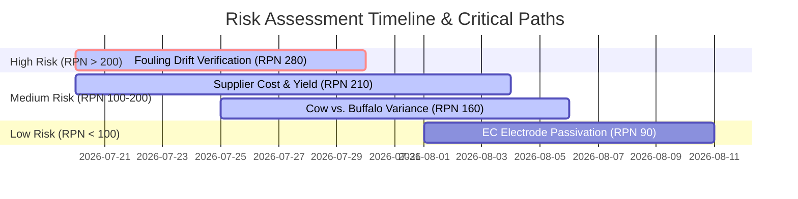

# 🥛 Handheld Milk Quality Analyzer: Engineering Validation Plan (Phase 5.5)

This document outlines the strict validation framework required to stress-test our design hypotheses and eliminate product risks before entering the EVT (Engineering Validation Test) phase or freezing CAD/PCB/BOM designs.

---

## 📋 1. Critical Assumption Register (CAR)

We treat the following design decisions as **hypotheses** requiring physical or statistical validation:

| ID | Category | Hypothesis Statement | Baseline Target Spec |
| :--- | :--- | :--- | :--- |
| **A-01** | **Optics** | A 5-degree tilt offset of the sapphire window redirects Fresnel back-reflections away from the photodiode active area, reducing the baseline optical measurement bias by $\ge 12\%$. | Fresnel reflection bias $< 1.0\%$ of full-scale. |
| **A-02** | **Algorithmic** | A second-order polynomial calibration mapping $P = \alpha R^2 + \beta R + \gamma$ (where $R = \frac{I_{940}/I_{\text{ref}}}{G_{\text{EC\_comp}}}$) is sufficient to linearize the non-linear Mie scattering decay of fat globules and match water-dilution percentage. | Dilution estimation error $< 5.0\%$ MAPE. |
| **A-03** | **DSP / EMI** | A second-order Butterworth digital IIR notch filter running on the ESP32-S3 can suppress 50Hz/60Hz mains noise and SMPS harmonics, ensuring stable readings in rural homes. | Conductance signal variance $\sigma \le 0.01 \text{ mS/cm}$. |
| **A-04** | **Sensing Fusion** | Dual-mode ATR (940nm) and 4-pole EC sensor fusion can accurately differentiate pure water dilution from chemically balanced adulteration (e.g., water + urea + salt). | False-positive rate $< 2.0\%$; False-negative rate $< 0.5\%$. |
| **A-05** | **Supply Chain** | Custom ground sapphire windows ($\varnothing 3\text{mm} \times 1\text{mm}$) can be sourced and polished to $Ra < 0.8\mu\text{m}$ at a unit cost of $<\$3.50$ (approx. Rs. 290) in quantities of 10,000 units. | Yield rate $\ge 98.5\%$ at production line. |

---

## 🧪 2. Experiment Matrix

To verify the Critical Assumptions, the laboratory team must execute the following testing protocol:

### Experiment 1: Optical reflection sweep (Verifies A-01)
*   **Methodology:** Align a 940nm VCSEL emitter and an Everlight silicon photodiode in a prototype jig. Measure the detector's baseline voltage ($V_{\text{out}}$) in air. Mount the sapphire window at angles from $0^\circ$ (flat) to $10^\circ$ in $1^\circ$ increments.
*   **Independent Variable:** Sapphire window tilt angle ($0^\circ\text{--}10^\circ$).
*   **Dependent Variable:** Parasitic reflectance bias voltage ($V_{\text{bias}}$) measured on the detector.

### Experiment 2: Titration and curve fitting (Verifies A-02)
*   **Methodology:** Prepare standard bovine milk samples. Perform a 10-point gravimetric water dilution series ($0\%$ to $50\%$ water in steps of $5\%$). Record the optical ratiometric value $I_{940}/I_{\text{ref}}$ and the temperature-compensated 4-pole conductance ($G_{\text{EC\_comp}}$). Fit a second-order polynomial regression model.
*   **Independent Variable:** Water dilution percentage ($0\%\text{--}50\%$).
*   **Dependent Variable:** Regression coefficient stability ($R^2$) and residual error.

### Experiment 3: EMI & environmental noise sweep (Verifies A-03)
*   **Methodology:** Place the 4-pole EC probe in milk. Introduce strong electromagnetic interference (EMI) sources (fluorescent ballasts, cheap SMPS mobile chargers, induction cooktops) within 15cm of the flow cell. Record raw ADC data. Apply the Butterworth IIR notch filter in firmware and evaluate the signal output.
*   **Independent Variable:** EMI noise sources.
*   **Dependent Variable:** Standard deviation of the measured conductance signal ($\sigma$).

### Experiment 4: Adulterant selectivity testing (Verifies A-04)
*   **Methodology:** Spike raw milk with combinations of common adulterants (water, salt, urea, detergent, starch) in different ratios. Map out the $[I_{940}, G_{EC}]$ vector space. Verify that the Decision Engine correctly routes each profile to the appropriate classification (e.g. `Suspicious`, `Added Water`, `Detergent`).
*   **Independent Variable:** Adulteration chemical profiles.
*   **Dependent Variable:** Classification accuracy percentage.

### Experiment 5: Supplier RFQ audit (Verifies A-05)
*   **Methodology:** Submit a detailed engineering spec sheet (sapphire window, $Ra < 0.8\mu\text{m}$, 5-degree chamfer) to 5 specialized optical manufacturers in India and China. Verify unit pricing, lead times, QA guarantees, and yield warranties.
*   **Independent Variable:** Supplier bids.
*   **Dependent Variable:** Verified unit price at 10k units volume.

### Experiment 6: Measurement System Analysis / Repeatability (MSA)
*   **Methodology:** Take a single raw milk sample at a stabilized $25^\circ\text{C}$ water bath. Run **30 consecutive measurement cycles** on the same device without removing the sample or recalibrating. Plot the distribution of the calculated Purity Index to isolate sensor/ADC thermal and random noise.
*   **Independent Variable:** Consecutive runs (1 to 30).
*   **Dependent Variable:** Purity Index variance and standard deviation.

### Experiment 7: Gage R&R / Reproducibility
*   **Methodology:** Assemble **three separate EVT Development Kits** (Sensors A, B, C) using different batches of LEDs and photodiodes. Have 2 separate lab technicians run a standardized 5-point milk dilution series on all three machines. Calculate the percentage of total variance contributed by the measurement system itself (Gage R&R).
*   **Independent Variable:** Machine ID (A, B, C) and operator ID.
*   **Dependent Variable:** Inter-device signal variance.

### Experiment 8: Environmental Stress Testing
*   **Methodology:** Subject the assembled flow cell and sensor housing to environmental stresses:
    1. **Thermal Cycling:** Expose the sensor to $5^\circ\text{C}$ (refrigerator environment) and $45^\circ\text{C}$ (Indian summer ambient) at 90% relative humidity for 48 hours.
    2. **Physical Drop Test:** Drop the unpowered PMMA flow cell structure from a height of 1.0 meter onto a concrete floor (5 times at different angles).
    3. **Resonance Fatigue:** Run the 40kHz PZT transducer continuously for 24 hours to test for joint cracking or leakage.
*   **Independent Variable:** Stress factors (temperature, drop, vibration).
*   **Dependent Variable:** Hermeticity (no leaks), physical integrity, and calibration stability post-test.

---

## 🎯 3. Pass/Fail Criteria

| Test Reference | Pass Condition | Fail Condition |
| :--- | :--- | :--- |
| **Exp 1 (Optics)** | Reflectance bias voltage drops by $\ge 12\text{dB}$ at $5^\circ$ tilt compared to the flat $0^\circ$ control. | Bias voltage reduction $< 8\text{dB}$ at the target tilt. |
| **Exp 2 (Calibration)**| Second-order polynomial curve fit achieves $R^2 \ge 0.95$ and residual error $< 2.5\%$. | $R^2 < 0.90$ or prediction residual error $> 5.0\%$. |
| **Exp 3 (DSP/EMI)** | Conductance signal standard deviation remains $\sigma \le 0.01 \text{ mS/cm}$ under active EMI. | Standard deviation exceeds $\sigma > 0.05 \text{ mS/cm}$. |
| **Exp 4 (UX/Decision)**| Classification accuracy matches the target Error Matrix below. | Fails to meet the False Positive/Negative targets. |
| **Exp 5 (Supply Cost)**| At least two supplier quotes guarantee unit price $\le \$3.50$ (Rs. 290) with yield rate $\ge 98.5\%$. | All quotes exceed $\$4.00$ or lead times exceed 60 days. |
| **Exp 6 (MSA)** | Repeatability standard deviation of Purity Index $\sigma_P \le 0.5\%$. | Standard deviation $\sigma_P > 1.0\%$, indicating high random noise. |
| **Exp 7 (Gage R&R)** | Total Gage R&R contribution to total study variance $\le 10\%$. | Gage R&R variance $> 30\%$, indicating high unit-to-unit variation. |
| **Exp 8 (Stress)** | Zero leaks under 2 bar static pressure; calibration baseline shift post-stress $\le 1.5\%$. | Dynamic leak detected, or calibration shift $> 2.0\%$ (requires manual recalibration). |

### 📊 False Positive / False Negative Target Matrix

Because consumer trust is vital, we enforce asymmetric error limits:

```
                  +------------------------------------------+
                  |               ACTUAL MILK STATE          |
                  |     CLEAN MILK     |   ADULTERATED MILK  |
+-----------------+--------------------+---------------------+
|   DECISION      |                    |                     |
|   ENGINE        |       PASS         |   FALSE NEGATIVE    |
|   OUTPUT        |  (True Positive)   |    Target: <0.5%    |
|                 |                    |  (Critical Hazard)  |
+-----------------+--------------------+---------------------+
|                 |   FALSE POSITIVE   |        FAIL         |
|                 |    Target: <2.0%   |   (True Negative)   |
|                 |  (Consumer Annoy)  |                     |
+-----------------+--------------------+---------------------+
```

---

## ⚡ 4. Risk Priority Number (RPN) Assessment

We calculate RPN as: $\text{Severity (S)} \times \text{Occurrence (O)} \times \text{Detection (D)}$ (Scale 1–10).



1. **Risk 1: Protein Biofilm Fouling on Sapphire**
   * *Description:* Casein micelles attach to the sapphire ATR window, mimicking fat presence and shifting the optical baseline.
   * *S = 8, O = 7, D = 5 | **RPN = 280** (High)*
   * *Mitigation:* Active 40kHz PZT ultrasonic scouring and software-level air-reference recalibration.
2. **Risk 2: Supply Chain Cost Escalation of Custom Sapphire**
   * *Description:* Low manufacturing yields or polishing difficulties drive up the cost of the sapphire window.
   * *S = 7, O = 6, D = 5 | **RPN = 210** (High)*
   * *Mitigation:* Source verification via early RFQ audit before final CAD lock.
3. **Risk 3: Model Mismatch on Cow vs. Buffalo Milk**
   * *Description:* High fat levels (7–10% fat in buffalo) saturate the trans-reflectance sensor, throwing off calibration curves.
   * *S = 8, O = 5, D = 4 | **RPN = 160** (Medium)*
   * *Mitigation:* Implement breed selection or auto-scaling variables in the firmware Decision Engine.
4. **Risk 4: Electrode Oxidation/Passivation**
   * *Description:* Direct current polarization degrades stainless steel EC probes over 5,000 cycles.
   * *S = 6, O = 5, D = 3 | **RPN = 90** (Low)*
   * *Mitigation:* Bipolar H-bridge high-frequency (100kHz) AC excitation.

---

## 🛠️ 5. EVT Development Kit Sourcing List

Before buying production components or tooling injection molds, the team will source only these developmental kit items to execute the Phase 5.5 experiments:

| Item | Description | Qty | Target Cost (INR) | Sourcing Source |
| :--- | :--- | :--- | :--- | :--- |
| **ESP32-S3-DevKitC-1** | ESP32-S3 developmental board | 3 | 1,800 | Electronics distributor |
| **AD5933 PMOD Board** | Impedance converter breakout | 3 | 2,400 | Digilent or equivalent |
| **OPA350UA DIP-8** | Operational amplifiers + adapter boards | 5 | 1,200 | TI Sourcing |
| **Vishay VSLB9530S** | 940nm Infrared LEDs | 10 | 450 | Mouser / Element14 |
| **Everlight PD204-6C** | Silicon photodiodes | 10 | 300 | Mouser / Element14 |
| **Standard Sapphire Discs** | $\varnothing 3\text{mm} \times 1\text{mm}$ ground sapphire | 5 | 1,500 | Glass fabricator |
| **EPDM O-Rings** | Shore A 70 sealing rings | 20 | 250 | Hardware store |
| **POM Block** | Raw polyoxymethylene stock for manual machining of flow cells | 1 | 500 | Local supplier |
| **TOTAL** | | | **8,400** | |

---

## 🛑 6. Go / No-Go Gate Conditions for CAD Freeze

The project cannot progress to CAD Freeze, PCB layout, or prototype sourcing until these conditions are met:
1. **Gate 1 (EVP Completion):** All 8 experiments in the Validation Matrix are completed and documented.
2. **Gate 2 (Performance Limits):** The Pass/Fail criteria for Exp 1, Exp 2, Exp 3, Exp 6 (MSA), and Exp 7 (Gage R&R) are fully satisfied.
3. **Gate 3 (BOM Verification):** High-volume BOM verification yields actual supplier quotes under Rs. 1,000 (total COGS).
4. **Gate 4 (Decision Matrix):** The Decision Engine logic is validated against the test library with False Positives $< 2.0\%$ and False Negatives $< 0.5\%$.
