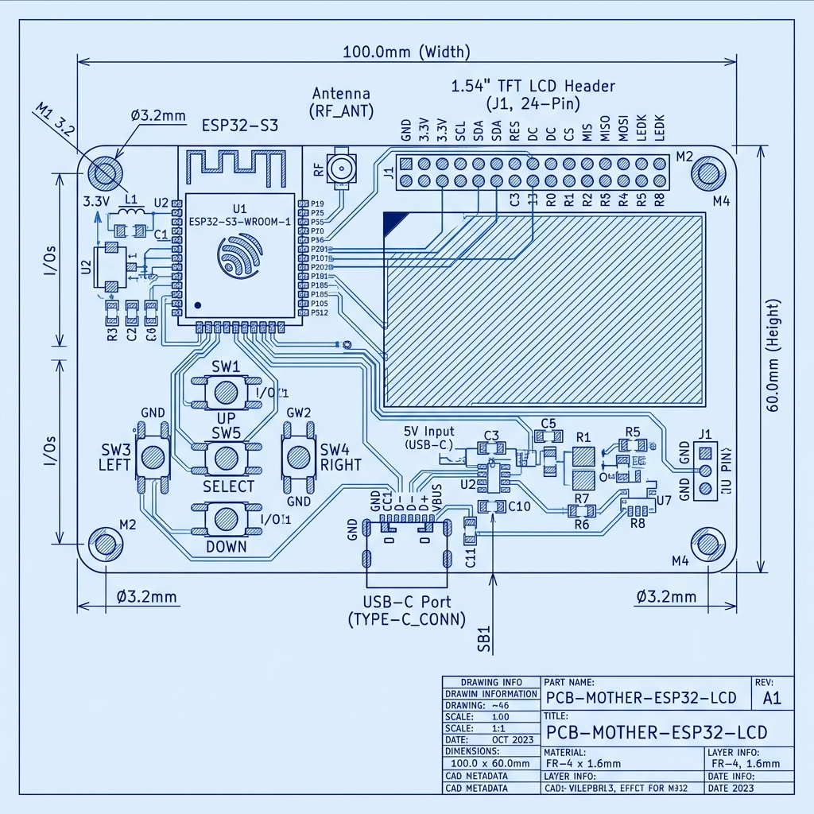

# 📐 06 - 2D Mechanical Blueprints & ASCII Diagrams

This document provides visual **2D Blueprints and ASCII Diagrams** showing exact dimensions, component floorplanning, wiring pathways, and mechanical probe tip cross-sections.

---

## 🖼️ 1. 2D CAD PCB Engineering Blueprint

Below is the 2D engineering blueprint diagram for the $100.0\text{ mm} \times 60.0\text{ mm}$ motherboard layout:



---

## 📐 2. PCB Physical Dimensions & Floorplan (ASCII Blueprint)

```
+-------------------------------------------------------------------+ (0,0) Top-Left
| [H1] (5,5)                                              (55,5) [H2] |
| (M3 Hole)                                              (M3 Hole)  |
|                                                                   |
|             +---------------------------------------+             |
|             |          ESP32-S3 MCU (U5)           |             |
|             |        (30mm, 20mm Position)          |             |
|             |  [ANTENNA KEEP-OUT ZONE: 15x7mm]      |             |
|             +---------------------------------------+             |
|                                                                   |
| [NTC Header J4] (8,12)                  (52,12) [EC Probe Header J3]|
| [940nm LED D4] (12,15)                  (48,22) [TLV9062 Buffer U9] |
| [Photodiodes D5/D6] (8,25; 16,25)        (48,35) [AD5933 Analyzer U8]|
| [TLV9062 TIA U7] (12,35)                 (55,30) [FID2]             |
| [FID1] (5,50)                                                     |
|                                                                   |
|             +---------------------------------------+             |
|             |        TFT Screen Header (J5)         |             |
|             |        (30mm, 48mm Position)          |             |
|             +---------------------------------------+             |
|                                                                   |
|                          [SW4 Up] (30,62)                         |
|           [SW6 Left] (20,70) [SW8 OK] (30,70) [SW7 Right] (40,70) |
|                         [SW5 Down] (30,78)                        |
|                                                                   |
| [Battery J2] (15,88)                 (42,88) [TP4056 Charger U1]  |
|                                      (52,88) [AP2112K LDO U4]     |
| [Buzzer J6] (15,96)                  (52,96) [UART Debug J8]      |
| [H3] (5,95)                 [FID3] (30,95)              [H4] (55,95)  |
|                               [J1 USB-C] (30,98)                  |
+-------------------------------------------------------------------+ (60,100) Bottom-Right
                                <--- 60 mm --->
```

---

## ⚡ 3. Subsystem Wiring Pathway & Flow Diagram (ASCII)

```
               +-------------------------------------------+
               | USB-C Connector (J1 - 5V Input)          |
               +--------------------+----------------------+
                                    |
                                    v
               +-------------------------------------------+
               | Polyfuse F1 (500mA) + ESD Array D8       |
               +--------------------+----------------------+
                                    |
                                    v
               +-------------------------------------------+
               | TP4056 Battery Charger (U1)               |
               +--------------------+----------------------+
                                    |
                                    v
               +-------------------------------------------+
               | DW01A + FS8205A Cell Protection (U2/U3)  |
               +--------------------+----------------------+
                                    |
                                    v
               +-------------------------------------------+
               | SPDT Slide Switch SW1 (Main Power Control)|
               +--------------------+----------------------+
                                    |
                                    v
               +-------------------------------------------+
               | AP2112K 3.3V LDO Voltage Regulator (U4)   |
               +--------------------+----------------------+
                                    |
                  +-----------------+-----------------+
                  | 3.3V Power Rail                   | Ground (GND)
                  v                                   v
+-----------------------------------+   +-----------------------------------+
|      ESP32-S3 Microcontroller     |   |      Sensors & Display Power      |
|  - GPIO1/2:  I2C (AD5933 EC)      |   |  - AD5933 VDD: 3.3V (C20/C21 caps) |
|  - GPIO5/6:  ADC (Optical TIA)    |   |  - TLV9062 VCC: 3.3V (C17 cap)    |
|  - GPIO7:    ADC (10k NTC Temp)   |   |  - TFT LCD VCC: 3.3V (C23/C24 caps)|
|  - GPIO9-14: SPI Display Bus      |   |  - Buttons: 3.3V via 10k Pull-ups |
|  - GPIO15-18, 8: D-Pad Buttons    |   +-----------------------------------+
|  - GPIO21:   Backlight PWM        |
|  - GPIO26:   Piezo Buzzer Gate    |
+-----------------------------------+
```

---

## 🔬 4. Sensor Probe Tip Physical Cross-Section (ASCII Diagram)

```
                   FRONT IMMERSION PROBE TIP (BOTTOM)
=========================================================================

       +-------------------------------------------------------+
       |               RUGGED BLACK ABS CASING                 |
       |                                                       |
       |  +-------------------------------------------------+  |
       |  |          FOOD-SAFE EPOXY SEAL (IP54)            |  |
       |  +----+-----------------+----------+---------------+  |
       |       |                 |          |                  |
       |       v                 v          v                  |
       |  +---------+   +-----------------+   +---------+      |
       |  | Stainless|   | Optical Sapphire|   | Stainless|      |
       |  | Steel Pin|   | Glass Window    |   | Steel Pin|      |
       |  |  (EC High|   | (940nm NIR LED  |   |  (EC Low|      |
       |  | Electrode|   |  + 2x Photodiodes|   | Electrode|      |
       |  |   J3 Pin1|   |   Emitter/Sens) |   |   J3 Pin2|      |
       |  +----+----+   +--------+--------+   +----+----+      |
       |       |                 |                 |           |
       |       |                 v                 |           |
       |       |       +-------------------+       |           |
       |       |       | NTC 10k Thermal   |       |           |
       |       |       | Sensor Probe Tip  |       |           |
       |       |       | (Connector J4)    |       |           |
       |       |       +-------------------+       |           |
       +-------+-----------------------------------+-----------+
               |                 |                 |
               v                 v                 v
          To J3 Pin 1       To Cable       To J3 Pin 2
          (EC Excite)       Harness        (EC Receive)
```

---

## 📱 5. Front Panel & Button Alignment Blueprint (ASCII)

```
+-------------------------------------------------------------------+
|                                                                   |
|               +-----------------------------------+               |
|               |                                   |               |
|               |         1.8" SPI TFT LCD          |               |
|               |         (ST7735S Display)         |               |
|               |       Resolution: 128 x 160       |               |
|               |                                   |               |
|               +-----------------------------------+               |
|                                                                   |
|                             [UP] (SW4)                            |
|                 [LEFT] (SW6) [OK] (SW8) [RIGHT] (SW7)             |
|                            [DOWN] (SW5)                           |
|                                                                   |
|             [EN RESET] (SW2)          [BOOT IO0] (SW3)            |
|                                                                   |
+-------------------------------------------------------------------+
```
